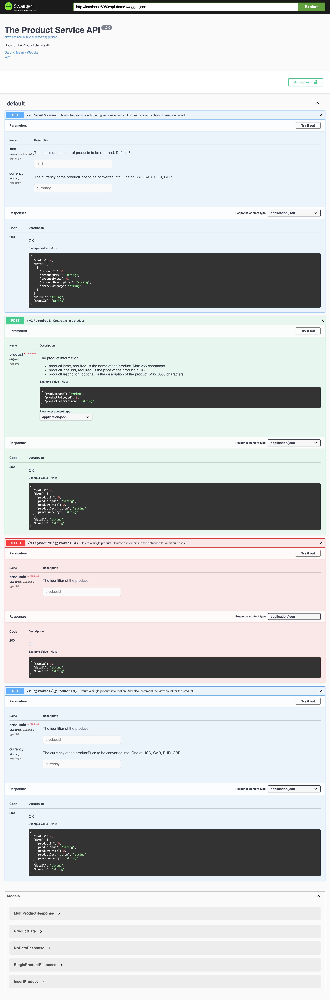

# product-service #

REST API for managing products. The API does the following:
- Create a new product.
- Get a single product. 
    - The request can optionally specify a currency, in which case the price is converted to the requested currency before being returned.
- List the most viewed products.
    - The request can specify a custom number of products to return. By default, the top 5 products will be returned.
    - The request can optionally specify a currency, in which case the price is converted to the requested currency before being returned.
- Delete a single product. 
    - After deleted, the product remains in the database, but it's not included in any of the API response.

[Swagger UI](#swagger-ui) is available at http://localhost:8080/swagger-ui to explore the API.

## Requirement ##

Get an api key from https://currencylayer.com.

## Build & Run ##

```sh
$ sbt flywayMigrate
$ CURRENCY_LAYER_API_ACCESS_KEY="123_api_key" sbt ~jetty:start 
```

Or use [Just](https://github.com/casey/just)

```sh 
$ just CURRENCY_LAYER_API_ACCESS_KEY="123_api_key" jetty-start
```

If `browse` doesn't launch your browser, manually
open [http://localhost:8080/](http://localhost:8080/) in your browser.

## Test ##

```sh
$ sbt flywayMigrate
$ CURRENCY_LAYER_API_ACCESS_KEY="123_api_key" sbt ~jetty:quicktest 
```

Or use [Just](https://github.com/casey/just)

```sh 
$ just CURRENCY_LAYER_API_ACCESS_KEY="123_api_key" test-refresh
```

Tested on AdoptOpenJDK Java 11.0.11.

## Swagger UI ##


